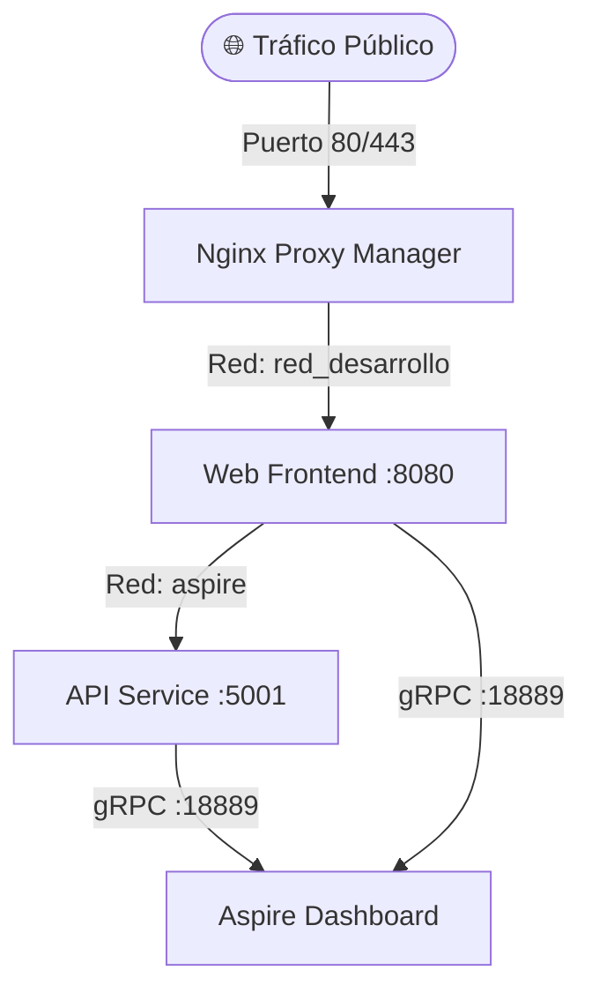

# 🤖 Arquitectura de Agentes - AgenteCoff

Este documento describe la arquitectura, la topología de red y el sistema de telemetría distribuidora del proyecto **AgenteCoff**, desplegado en un entorno de contenedores Docker automatizado.

## 🏗️ Descripción General del Sistema

El ecosistema de **AgenteCoff** está diseñado bajo un enfoque de microservicios acoplados, donde los agentes consumen y exponen servicios protegidos detrás de un proxy inverso, monitoreados en tiempo real mediante OpenTelemetry.

---

## 🧩 Componentes del Ecosistema

### 1. `webfrontend` (Agente de Interfaz)
* **Imagen:** `damianns1/agentecoff-web:latest`
* **Propósito:** Expone la interfaz de usuario para la interacción con los agentes.
* **Puerto Interno:** `8080`
* **Conectividad:** 
  * Pertenece a la red `aspire` para hablar con la API.
  * Pertenece a la red externa `red_desarrollo` para recibir tráfico de Nginx.

### 2. `apiservice` (Cerebro del Agente)
* **Imagen:** `damianns1/agentecoff-api:latest`
* **Propósito:** Orquesta la lógica de negocio, reglas de IA y procesamiento de datos.
* **Base de Datos:** SQLite centralizada en volumen local (`agentecoff.db`).
* **Puerto Interno:** `5001`
* **Conectividad:** Aislado en la red `aspire`.

### 3. `mi-red-hogarena-dashboard` (Métricas y Telemetría)
* **Imagen:** `aspire-dashboard:latest`
* **Propósito:** Panel de control de .NET Aspire para analizar trazas, logs distribuidos y métricas de rendimiento (OTLP) de los agentes.
* **Puertos:** `18888` (UI de Monitoreo) y `18889` (Puerto gRPC de recolección).

---

## 📡 Protocolos y Comunicación Interna

### Flujo de Telemetría (OpenTelemetry)
Tanto el `webfrontend` como el `apiservice` exportan datos de diagnóstico utilizando el protocolo **OTLP/gRPC** hacia el Dashboard central mediante las siguientes variables de entorno:

* `OTEL_EXPORTER_OTLP_ENDPOINT`: `http://mi-red-hogarena-dashboard:18889`
* `OTEL_EXPORTER_OTLP_PROTOCOL`: `grpc`
* `DASHBOARD__OTLP__AUTHMODE`: Protegido mediante clave API (`ApiKey`).

### Seguridad y Proxy
El tráfico exterior es administrado por **Nginx Proxy Manager** en el VPS. El proxy redirige las peticiones del dominio hacia el contenedor `webfrontend` apuntando al puerto `8080` usando resolución de nombres nativa de Docker.

---

## 🚀 Ciclo de Vida y Despliegue Automatizado (CI/CD)

El despliegue de los agentes está completamente automatizado mediante **GitHub Actions** (`.github/workflows/deploy.yml`):

1. **Compilación Nativa:** El SDK de .NET genera imágenes de contenedor optimizadas para Linux-x64 sin necesidad de un `Dockerfile` tradicional (`PublishContainer`).
2. **Distribución:** Las imágenes se publican automáticamente en Docker Hub bajo el tag `:latest`.
3. **Actualización en Caliente:** GitHub se conecta vía SSH (puerto personalizado `5583`) al servidor de DonWeb, ejecuta un `docker compose pull` y recrea los contenedores minimizando el tiempo de inactividad.

---
*Documento actualizado en Agosto de 2026.*
